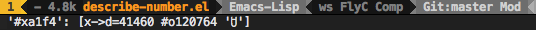
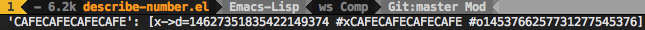

# describe-number

[](http://melpa.org/#/describe-number)
[](http://stable.melpa.org/#/describe-number)

Describe arbitrarily large number value at point or region in Emacs. If value is a number then binary/octal/decimal/hexadecimal/character values and conversions are shown. For strings each character is processed in the same way.

Arbitraily large numbers are support via [yabin.el](https://github.com/d5884/yabin).

Use `describe-number-at-point` on point/region or `describe-number` to input value manually.

Might be preferable to bind `describe-number-at-point` to some key:
```elisp
(global-set-key (kbd "M-?") 'describe-number-at-point)
```

# Demo
When using "101" as input to `describe-number-at-point` or `describe-number`:


The package understands binary, octal, and hexadecimal prefixes, i.e. "b", "0b", "#b"; "o", "0o", "#o"; and "x", "0x", "#x" respectively:



Arbitrarily large number inputs are supported:



In the case of using a string, e.g. "bin", it will process each character value separately:


"b->d" means binary to decimal, "o->d" means octal to decimal, and "x->d" means hexadecimal to decimal.
